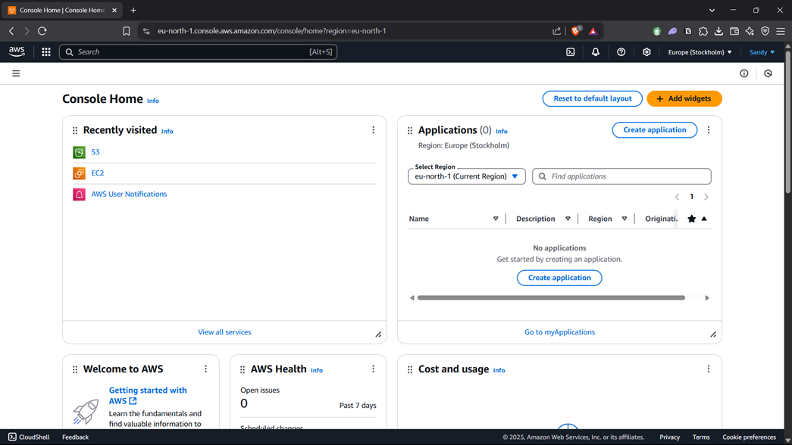

# Name: Santhosh K
# RegNo: 212223100050

# EX NO-1-CREATE AN ACCOUNT IN AWS SET UP A ROOT USER AND AN IAM USER
## AIM
To Create an Account in AWS Set up a Root user and an IAM user.

## PROBLEM STATEMENT
This experiment aims to guide users through the process of creating an AWS account, understanding the significance of the root user, and setting up an IAM user for everyday tasks. The root user has unrestricted access to all AWS resources, while IAM users allow for more controlled access management.

## ALGORITHM
Step 1: Create an AWS Account.
Step 2: Sign in as Root User.
Step 3: Secure Your Root User.
Step 4: Create an IAM User.
Step 5: Assign Permissions.
## OUTPUT
### ROOT USER: 

### IAM USER: 
.png)
## RESULT
Thus, Creation of an account in AWS and Set up of Root user and an IAM user is done successfully.

